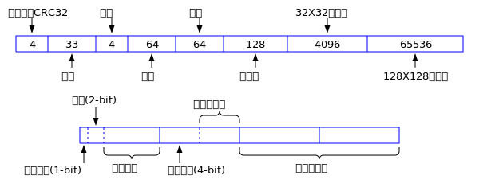

# WoChat的数据库设计

Wochat的客户端采用sqlite数据库作为基本的数据存储技术。一个完整的可运行的WoChat聊天软件包括wochat.exe和wt.db两个文件，其中wochat.exe是可执行文件，wt.db是和wochat.exe在同一目录下的sqlite数据库文件。wochat.exe在启动时会检测本目录下是否有wt.db文件。如果没有，wochat.exe会创建一个新的wt.db文件，并往其中写入缺省的信息。用户可以修改其中的数据，改变软件的界面和运行行为。

本文档论述了sqlite数据库wt.db的表结构设计。

## 设计规则

表的名字用一个小写字母来表示，列的名字用两个小写字母或者一个小写字母加一个数字的方式来表明。

核心表共4个：
- c : 配置表，表示config的意思。它里面记录了软件运行所需要的各种参数。
- k : 密钥表，表示key。它里面记录了所有的私钥信息。这些私钥当然是已经加密的。
- p : 联系人表，表示people。它里面记录了联系人的信息。
- m : 消息表，表示message。它是体积最大的表，里面记录了各种发送和成功接受到的消息，包括文本，图片，视频，和其它各种文件。

此外还有一个表q，里面记录了已经接收到的，但是无法解密的消息包。这张表的目的是供审计使用，它对软件的运行没有任何影响。

未来随着功能的不断增加，还会有新的表加入进来，但是满足基本聊天功能的表只有c,k,p,m四张。

基本的数据类型是整型INTEGER, 字符串类型TEXT，二进制类型BLOB。所有的字符串均以UTF8进行编码。

## 表结构

本节论述了各种表的具体含义。

### 配置表c

该表的定义如下：
```sql
CREATE TABLE c
(
id INTEGER PRIMARY KEY,  -- 主键，每一个参数的定义，可以参考wochatypes.h这个文件中的WT_PARAM_xxxx的定义
tp INTEGER NOT NULL,  -- 该参数的类型，0表示整形，1表示UTF8编码的字符串，2表示二进制信息。 3表示浮点数。
i0 INTEGER,  -- 整型
i1 INTEGER,  -- 整型
tx TEXT,     -- 以UTF8编码的文本信息
bb BLOB      -- 二进制信息，存储图片等内容。
);
```

说明：
- 如果tp=0,表示id表示的参数的值保存在i0这一列中。tp=1表示id表示的参数的值保存在tx这一列。tp=2表示id表示的参数的值保存在bb这一列中。
- 如果tp=3，id表示的参数的值保存在i0和i1这两列中。其中，i0是整数部分，i1是小数部分。

### 私钥表k
```sql
CREATE TABLE k
(
	id INTEGER PRIMARY KEY AUTOINCREMENT,  -- 序列号，从1开始，1,2,3,...
	pt INTEGER,  -- 父节点，如果是0，表示原始私钥。如果是1，这表示这把私钥是1号私钥加密的
	at INTEGER,  -- 该私钥是否已经被禁止，处于非活跃状态： non-zero = active, 0 - disable
	dt INTEGER,  -- 8字节的时间
	sk CHAR(64) NOT NULL UNIQUE,     -- 被AES256加密过的密钥。 pt=0的私钥由口令加密，pt为非0的，有对应的私钥加密
	ub BLOB	  -- 公钥，用户信息，包含姓名，性别，生日，座右铭，所在地区，32X32小头像和128X128的大头像都保存在这个域中。
);
```

当用户登录WoChat时，需要在一个下拉别表框中选择用户名N，然后输入口令P。N就是name这一列的值。P包含所有合法的ASCII字符，长度不限。P经过SHA256哈希后得到的32个字节用于对sk进行解密。加解密的算法是AES256。对sk解密后，由sk可以计算出pk0。 然后拿pk0和pk这一列进行对比，就可以知道sk是否是被成功地解密了。

任何时刻，用户只能使用一个sk进行登录。当然用户可以开启多个WoChat进程，每一个进程有自己的sk。这样用户在一台机器上就可以使用多个账号同时聊天了。对于群聊，群内的每一个成员都拥有这个群的sk。当一个群成员被踢出该群后，这个群必须新产生一个sk。群聊的问题后面再研究。

ub的格式如下：

 

### 联系人表p
```sql
CREATE TABLE p
(
	id INTEGER PRIMARY KEY AUTOINCREMENT, -- 序列号，从1开始，1,2,3,...
	dt INTEGER,   -- 8字节的时间
	at INTEGER,   -- 该公钥钥是否已经被拉黑，处于非活跃状态： non-zero = active, 0 - disable
	me CHAR(64),  -- 因为WoChat支持多账号模式，所以这个域表示是哪个用户的好友。此域保存被加密后的私钥。
	pk CHAR(66),  -- 好友的Public Key
	nm TEXT,      -- 自己给这位好友起的名字，便于管理。可能有些好友有重名，可以通过修改这个域来标识不同的好友。
	sr TEXT,      -- 该用户的来源，自己加的？系统自带的？还是从别的群里
	ub BLOB,      -- 好友的信息，包括：CRC32, 公钥, 用户信息，包含姓名，性别，生日，座右铭，所在地区，32X32小头像和128X128的大头像。
);
```

ub里面的信息请参考：

 

其中姓名，座右铭，所在地区都是以UTF8编码的字符串。姓名和所在地区，字符串最大长度64，可以表示大约20多个汉字，长度足够了。座右铭最长128字节，可以表示40多个汉字。 对于utf8字符，它后面的补充字节全部是0。 属性这个域将来用于做群聊管理使用，对于单个用户，这个字节为0，群的管理未来再规定。 ub域的长度是 4 + 33 + 3 + 1 + 4 + 64 + 128 + 64 + 65536 = 65837个字节

当数据库第一次被创建后，id=1的好友是机器人Robot的公钥。id>1的好友才是普通好友。


### 消息表m
```sql
CREATE TABLE m
(
	id INTEGER PRIMARY KEY, -- 序列号，从1开始，1,2,3,...
	dt INTEGER,  -- 8字节的时间
	st INTERGE,  -- 如果是我方发送的消息，这个字段表示是否发送成功 non-zero - 成功, 0 - failed。接收的消息，这个字段没有意义
	hs CHAR(64), -- 原始消息的SHA256哈希值
	sd CHAR(44), -- 发送者的公钥，base64编码
	re CHAR(44), -- 接收者的公钥，base64编码
	tp CHAR(1),  -- 分隔符，#, @, ?等
	tx TEXT      -- 是base64编码过的，所以都是可打印字符。
);
```

如果tp是#，表示tx是UTF8编码的文本信息。
如果tp是@，表示tx是对方收到消息后的确认信息。
如果tp是$，表示tx是纯二进制信息。
如果tp是%，表示tx是链接信息。 在其它文档中进行定义。


### 无法解密的接收消息表q
```sql
CREATE TABLE q
(
	id INTEGER PRIMARY KEY AUTOINCREMENT, -- 序列号，从1开始，1,2,3,...
	dt INTEGER, -- 8字节的时间
	tx TEXT     -- base64编码的原始消息包，所以都是可打印字符
);
```

### 日志表g
```sql
CREATE TABLE g
(
	id INTEGER PRIMARY KEY AUTOINCREMENT, -- 序列号，从1开始，1,2,3,...
	dt INTEGER, -- 8字节的时间
	tx TEXT     -- base64编码的原始消息包，所以都是可打印字符
);
```

