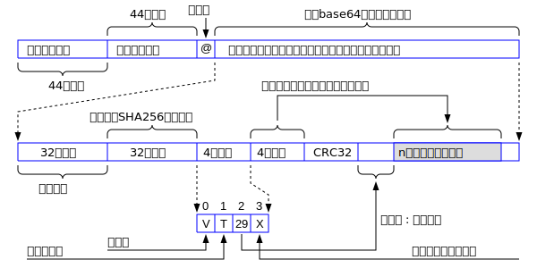

# WoChat消息的加密规范

虽然普罗大众可能对加密和解密的技术了解不多，但是任何人对加密和解密的基本概念还是有正确的理解的，因为通讯安全是任何人的基本需求。微信的聊天数据很显然是不加密的，证据之一就是：如果你在微信中发表过激言论，很可能不久以后你就被腾讯公司封号，这表明有人在监控你的聊天信息。WoChat的理念就是采用世界上第一流的加密技术，确保每个人的通讯数据不被任何公司或者政府监控。本文档论述WoChat加密体系的设计规范，任何人都可以对本规范提出异议或者修改意见。让我们一起努力，设计出完美无缺的加密体系，保护每个人的通讯隐私权利。

## 加密技术快速入门

回归问题的本质，现在我们假设一个场景：张三想把一段明文(plain text)传递给他的好友李四。为了更准确地表达设计思想，我们采用类似数学记号的方式，把这段明文用P来表示。为了不让第三者看到传递的内容，张三使用密钥(key)把P变成了密文(cipher text)。类似的，我们用K表示密钥，用C表示加密后的密文。我们可以用如下的数学公式来表示P、K和C之间的关系：
```
C = f(P, K)
```

这个公式表明，密文C是某个函数f计算出来的。函数f被称为加密算法，该函数的输入参数有两个：明文P和密钥K。假设我们要发送的明文数据有n个字节，可以使用如下C语言变量来表示明文：

```c
unsigned char plaintext[MAX_LENGH];
unsigned int  plaintext_length;
```
其中plaintext是一个最大长度为MAX_LENGH的数组，plaintext_length表示plaintext实际的长度n，它的取值范围是1到MAX_LENGH。因为WoChat使用的是MQTT协议传输数据，MQTT协议的消息包的最大尺寸是256M，所以n比256M要稍微小一点，因为要考虑额外的各种字节开销。

截止到目前为止，加密算法分为对称加密(symmetric encryption)算法和非对称加密(asymmetric encryption)算法两大体系。 两种加密体系的区别是非常容易理解的，下面我们分别论述它们的基本思想。

### 对称加密算法

对称加密的基本思想可以用“解铃还须系铃人”来概括，就是使用同一把密钥K对明文P进行加密和对密文C进行解密，用公式表示就是：
```
C = f(P, K)
P = g(C, K)
```
在上述两个公式中，f是加密算法，g是解密算法。最流行的对称加密算法是AES(Advanced Encryption Standard)算法和Chacha20算法。对称加密算法又分为块(block)加密算法和流(stream)加密算法。AES是块加密算法，Chacha20是流加密算法。

 块加密算法的基本思想是把明文P分成固定尺寸的块，然后对这个固定大小的块进行加密。譬如：AES算法把P分为16字节的块，如果P的长度不是16字节的倍数，则最后不足16字节的块需要按16字节补齐一些额外的无关字节。 

 流加密算法的基本思想是利用一个初始的密钥K产生一个无穷无尽，很可能不重复的比特流(bit stream)，然后把这个比特流和明文P按每个字节进行异或(XOR: eXclusive OR)操作。异或操作是非常容易理解的，假设我们用^表示异或运算，异或操作一共有4个可能性：
```
0 ^ 0 = 0
0 ^ 1 = 1
1 ^ 0 = 1
1 ^ 1 = 0
```

下面是一个流加密的简单的例子，明文P是2个字节，流加密算法也产生了2个字节的密钥K，两者进行异或操作就得到了密文C。

```
K:  10110001,10111000
P:  11001010,10101011
C:  01111011,00010011
```

异或操作存在如下规律：

```
X ^ Y = Y ^ X
X ^ 0 = X
X ^ X = 0
C = P ^ K
P ^ K ^ K = P
P = C ^ K
```

第一个公式表明异或操作满足交换律。第二个公式表明0和任何数据异或，依然是该数据本身。第三个公式表明两次和同一个数据进行异或，就相当于啥也没干。第四个公式表明密文C是由明文P和于P长度相同的密钥流K异或得到的。第五和第六个公式揭示了解密的过程，就是密文再次和同样的K异或就得到了明文。

流加密算法的一个特征是：密文C的长度和明文P的长度是一样的。假设明文P的长度是n个字节，流加密算法产生的密钥也必然是n个字节，我们把流加密算法产生的和明文P长度相同的密钥称为密钥流(key stream)。 这里要区分流加密的初始密钥K和密钥流两个概念。 初始密钥是密钥流的种子。譬如Chacha20算法使用的初始密钥K是32字节。不同的初始密钥产生的密钥流很显然是不同的。

流加密算法的密文C的长度和明文P的长度是一样的特点给攻击者提供了明文长度的敏感信息。如果明文的长度很短，只有几个字节，明文的长度信息对攻击者就是一个很大的提示作用。 譬如，你发送的消息是“对”这个汉字，在UTF16编码中它就是2个字节。攻击者获悉你发送的数据仅仅是2个字节时，他完全可以采用暴力破解的方法，罗列所有的可能性。 为了不让攻击者获得短明文的长度信息，我们规定：如果P小于252个字节，我们就把P作为一个整体嵌入到一个252字节的随机数据包中，让攻击者无法知道明文的长度。

如果AES算法使用的密钥K是32字节，我们称这个算法为AES256，它是目前已知的最安全的对称加密算法之一。Chacha20的密钥也是32字节。 WoChat采用AES256和Chacha20(32字节的密钥)作为对称加密的算法，其中Chacha20用来加密真正的数据，AES256用来加密会话密钥和SHA256的哈希值，其中的细节在后文中会介绍。

发送者用密钥K对P进行加密后形成密文C，他必然要把K和C都发送给接收者。 接收者光有C，没有K，当然无法完成解密的工作。对称加密算法最大的挑战是如何把密钥K安全可靠地传递给接收者。我们假设在发送者和接收者之间的通讯渠道是非常恶劣的，两者之间发送的任何信息都被第三者轻易地捕获到。你当然可以用另外一个密钥K1加密K，但是你依然存在如何把K1安全可靠地传递给对方的问题，所以光依靠对称加密算法本身是无法解决这个问题的。这个挑战的答案就在于下面我们要介绍的非对称加密算法体系中。

### 非对称加密算法

非对称加密算法和对称加密算法的最大不同点在于，在非对称加密算法中，发送者和接收者分别有一个密钥对(key pair)，就是两把密钥：一把是私钥sK(secret Key)，一把是公钥pK(public Key)。 私钥，顾名思义，就是私密的，不能够被别人掌握的密钥。所以私钥和对称加密算法中的密钥K一样，必须被妥善地保存，它的泄露就意味着整个加密过程和加密体系被破解。公钥，顾名思义，就是公开的，可以被任何人知道的密钥。既然公钥是需要被公开的，所以它不应该被称为“密”钥。我们可以把公钥理解为私钥的唯一性标识Id(identifier)，它唯一性地确定一个私钥的拥有者。所以，在WoChat的账号体系中，每一个账号就是一个公钥。用户名仅仅是公钥的一个昵称，供人类来区分不同的公钥而已。起到加密和解密实质作用的是公钥，而不是用户名，这一点需要读者理解清楚。

为了给初学者一个直观的印象，我们举一个例子。下面是一对有效的密钥对，第一行是私钥，32个字节。第二行是公钥，33个字节。

```
sK = E3589E51A04EAB9343E2AD073890A1A2C1B172167D486C38045D88C6FD20CBBC
pK = 0288D216B2CEB02171FF4FD3392C2A1AC388F41FBD8392A719F690829F23BCA8E5
```

公钥和私钥具有的规律是：如果你拥有了一个私钥sK，你很容易快速地计算出与之对应的公钥pK，反过来则不行。如果你知道了某个人的公钥pK，你无法推导出pK对应的私钥sK，这是非对称加密算法设计时就充分考虑过的问题。所以任何人的公钥pK都可以放心大胆地被传播，完全不需要担心别人利用自己的公钥pK能够推算出自己小心翼翼守护的私钥sK。

假设发送者的私钥是sK1，公钥是pK1，接收者的私钥是sK2，公钥是pK2，则下面的公式成立：

```
C = f(pK2, P)
P = g(sK2, C)

C = f(pK1, P)
P = g(sK1, C)
```

上述公式表明：发送者使用接收者的公钥pK2对明文P进行加密，接收者收到密文C后使用自己的私钥sK2可以对明文进行解密。因为pK2是任何人都知道的，所以任何人都可以使用pK2来加密消息，但只有sK2的持有者才能够解密和阅读被加密的信息。 类似的，接收者可以用发送者的公钥pK1来加密数据，发送者使用自己的私钥sK1来解密，实现双向通讯。在通讯过程中不存在密钥在通讯双方之间传送的问题。这是非对称加密体系相较于对称加密体系的一个巨大的优势。

非对称加密拥有和对称加密截然不同的密钥设计，一切看起来都这么完美，岁月静好。但非对称密钥依然无法解决一个问题：如何证明某个公钥pK是属于某个人的？这是一个超出加密解密知识范围的问题，但却是我们需要解决的一个实际问题。 一种解决思路是找第三方权威机构做背书和证明，证明某个公钥pK是属于某个人的。这就引入复杂的CA(certificate authority)系统。 

在目前开发阶段，为了简便可行，WoChat并不会引入权威的第三方权威机构做背书。WoChat使用的非对称加密算法的公钥是33个字节，变成十六进制的人可读的字符串，才66个字符，所以朗读一遍可以在几分钟之内完成。你拿到某个号称是某个人的公钥后，你可以打电话给他，让他在电话中大声朗读自己的公钥。他一边朗读，你一边核对，不到一袋烟的功夫可以完成验证工作。 

当你已经验证了某个公钥的的确确是属于某个你熟知的朋友以后，你就可以放心大胆地使用这把公钥加密数据发送给他。因为你可以百分百地确定：在这个世界上只有你的这位朋友可以读取你发送的加密数据，拜登爷爷和普京大叔想偷窥都不可能做到。当然，在量子计算机大规模投入实用以后，我们可能做不到百分百有信心。不过如果此时此刻你处于量子计算机大规模普及的时代，你很有可能看不到这篇文档了 :-)。

非对称加密的常见算法有RSA和椭圆曲线ECC(Ellipse Curve Cryptography)加密算法。WoChat采用来自比特币内核的非对称加密算法secp256k1，它属于ECC算法家族中的一种。比特币的成功证明了这种算法的可靠性，所以我们可以放心大胆地使用在WoChat中。它的源码可以在比特币内核源码中找到( https://github.com/bitcoin/bitcoin/tree/master/src/secp256k1 )。 这是一个单独的模块，不依赖比特币内核的其它代码，所以你可以抠出来放在自己的应用中使用。

在secp256k1算法中，私钥sK没啥特别之处，它就是一个32字节的随机数，可以用任何你信任的随机数产生器(random number generator)产生出来。一旦sK产生出来后，公钥pK可以由sK轻松计算出来，反过来则不可能由pK计算出sK。公钥pK的长度是65个字节，但是可以压缩。压缩后的公钥是33个字节，实际上是257个比特，包含256比特的真正数据和一个标记比特位。我们可以这样记忆：私钥32个字节，公钥33个字节。

在椭圆曲线算法中，公钥和私钥实际上是二维笛卡尔坐标中的某两个点。每个点的位置可以用坐标(x,y)来表示。secp256k1使用的椭圆曲线可以由如下公式表示：

```
y^2 = x^3 +7
```

这里的^表示指数的意思，不表示异或。上述公式非常简单，就是y的平方等于x的立方加上7，就这么简单！这是初中生都非常容易理解的公式。 很显然，这条曲线是围绕x轴上下对称的，如果某个点(x,y)在该椭圆曲线上，则(x, -y)也必定在该椭圆曲线上。压缩版公钥额外多出来的标记比特位表示正负号，记录最终的点是(x,y)和(x,-y)两者的哪一个，具体的细节我们就不深究了。压缩版的公钥pK有一个很容易记忆的规律：它的第一个字节肯定是02或者03，不可能是别的值，这个值就是记录正负号的。 

现在我们来学习一下secp256k1算法如何解决前文中对称密钥传递困难的问题。在secp256k1算法中，存在一个规律，用公式表示如下：

```
Kp = f(sK1, pK2) = f(sK2, pK1)
```

在上述公式中，Kp是一个32字节的密钥，它是发送者的私钥sK1和接收者的公钥pK2计算出来的，也可以由接收者的私钥sK2和发送者的公钥pK1计算出来。我们可以把Kp理解为发送者和接收者之间的一个小秘密，双方都知道的一个巨大的数字。 因为发送者和接收者之间心有灵犀一点通，在他们通讯过程中不需要传递Kp，因为双方都知道嘛，所以任何第三方是不可能知道Kp的。这一点非常非常重要，这是WoChat的安全体系的基石。secp256k1算法就是利用这一点，巧妙而完美地解决了对称加密算法无法解决的密钥传递问题，解决之道就是：密钥无需传递！

一旦发送者和接收者被确定后，他们之间的Kp是固定不变的，因为sK1和pK2，或者sK2和pK2都确定了。我们把Kp称为两者之间通讯过程的主密钥(primary key)，它是最重要的密钥，可以加密其它密钥。很显然，Kp的安全性由sK1和sK2来保证：一旦sK1或者sK2被泄露，则Kp就泄露了，所以保护私钥sK是整个安全体系唯一需要特别特别小心的地方。

我们同样可以反过来说，只要私钥sK没有泄露，整个安全体系在理论上是完美的，没有任何漏洞。 在实践中，我们使用口令来保护私钥。你输入一个任意长度的口令，该口令被SHA256算法哈希成32字节的哈希值，然后我们用这个哈希值和AES256算法对sK进行加解密。

口令和密钥是两个完全不同的概念，口令的作用仅仅是用来保护私钥sK。真正加密和解密工作是sK和pK完成的。 我们把口令的UTF8编码的数据进行SHA256哈希，得到的哈希值是加密私钥sK的密钥。所以用户输入的口令可以包含任何字符，汉字也可以。口令的长度不限，可以任意长。当然越长的口令越不容易被破解。 

如果某个用户的sK被泄露，只影响他和别人之间的通讯安全，不会影响别人之间的通讯安全。 当你的私钥sK被泄露以后，你可以重新产生一把私钥，因为它无非就是一个32字节的随机数嘛。 当你产生新的私钥sK后，公钥pK也随之发生改变，你依然需要向别人证明pK是属于你的。最简单的办法就是打电话通知朋友，然后在电话中核对你的公钥。

非对称加密算法虽然有很多的优点，但是它的加密和解密速度慢，只适合加密和解密少量数据。譬如，加密32字节的时间是可以忍受的，如果用非对称加密算法加密1MB字节的数据，所花费的时间就无法忍受了。但是1MB字节这点数据量对于对称加密，尤其是流加密算法，完成加密和解密就是一眨眼的功夫。 我们可以把对称加密和非对称加密算法的优点结合起来，形成优势互补的方案：大批量真正的数据依然使用对称加密算法进行加密，所使用的密钥K可以由非对称加密算法加密。所以在WoChat的加密体系中，真正干苦活累活的是对称加密算法AES256或者Chacha20，牵牛鼻子的是非对称加密算法secp256k1。


## WoChat加密的设计思想概述

在WoChat加密的过程中，真正的数据采用流加密算法Chacha20。流加密算法的一个特征就是明文和密文的长度相等。因为我们在聊天过程中大部分时间输入的文字长度都很短，譬如：你好啊，非常棒！赞一个！ 我要下线了，你多保重等等。 为了不让攻击者获得短明文的长度信息，我们做如下设计：如果n小于252个字节，我们就构造一个252字节的随机数据包，把明文数据作为一个整体，嵌入到这个随机数据包中。明文在这个数据包中的存放是连续的，所以我们需要两个变量来标记明文在这252字节中的位置：长度n和偏移量offset。n的取值范围是1到251。offset的取值范围是0到252 - n。 为什么选择252呢？目的是为了让整体的长度凑成3的倍数，经过base64编码后就不存在补齐的等号(=)了，因为base64的基本思想是把3个字节的原文变成4个字节的编码。一个字节是8比特，3个字节是24比特，24 = 4 X 6，所以可以被分为4个6比特，6比特可以由64个字符组成，包括0-9, A-Z, a-z, +和/，共计64个普通可打印的字符，这是base64的基本设计思想。

如果n大于等于252个字节，则不需要上面的凑齐操作，所以offset恒定为0。

经过上面处理的明文，如何进行加密呢？ 我们会产生一个32字节的随机数，作为加密所使用密钥Ks，使用流加密算法Chacha20对真正的数据进行加密。Ks被称为会话密钥(session key)。所谓会话(session)密钥，指的是每次(session)加密操作都选择不同的密钥，一次一密。很显然，Ks是需要随着加密后的密文一起发送给接收者的。我们不可能把Ks的明文发送给接收者，否则任何人都可以解密了，所以我们必须要对Ks进行加密。对Ks加密所使用的算法是AES256，所使用的密钥是主密钥Kp，32个字节。Kp是由发送方的私钥sK1和接收方的公钥pK2计算出来的。同时，接收方的私钥sK2和发送方的公钥pK1也可以计算出Kp，所以Kp不需要传递，这是WoChat整个安全体系的根本保证。

总结一下：真正的数据使用Chacha20流加密技术，一次一密，所使用的密钥Ks是32字节的随机数，Ks被称为会话密钥。 Ks本身由AES256算法进行加密，所使用的密钥Kp是利用椭圆曲线的公钥和私钥计算出来的。概括成两句话，那就是：主密钥Kp加密会话密钥Ks，Ks加密真正的数据。每次加密，Ks都不一样，而Kp是固定的。 Kp,Ks和明文三者的关系可以表示如下：

```
Kp --(AES256)--> Ks --(Chacha20)--> P
```

以上就是WoChat加密规范设计时所依赖的基本思想。 在理解了基本思想后，我们来看看WoChat加密消息包的具体格式。

## 加密格式的具体规范

目前WoChat消息包分为两种类型，包含真正数据的普通消息包、操作消息包。以后随着开发的功能越来越多，可能会增加新的消息包类型，但是基本的格式会保持不变。

下面依次论述这两种不同类型的消息包。

### 普通消息包

在WoChat通讯过程中，这种消息包属于最常见的类型，因为其中包含通讯双方真正想交流的数据。这些数据可以是文本，也可以是图片、视频等二进制信息。 这种消息包的规范可以用下图表示。

 

如图所示，整个消息包分为三部分，在第二和第三部分中间包含一个字节的分割符，是@符号。下面介绍每一个部分的内容。

#### 消息包的第一部分

消息包的第一部分就是头44个字节。它记录着发送者的公钥的base64编码的字符串。因为椭圆曲线secp256k1算法的公钥是33个字节，变成base64编码后就是44个字节。

#### 消息包的第二部分
消息包的第二部分紧挨着第一部分，它的长度也是44个字节。它记录着接收者的公钥的base64编码的字符串。因为椭圆曲线secp256k1算法的公钥是33个字节，变成base64编码后就是44个字节。

#### 消息包的第三部分

从第90个字节开始到消息包的最后，都是base64编码的数据。这些数据是消息包的第三部分。 这部分的数据经过base64解码后得到的数据包是加密的，它分为六个域。头五个域的长度是固定的，分别是32字节，32字节，4字节，4字节和4字节，共计76个字节。第六个域保存真正的数据，它的长度n是可变的，最小是248个字节。MQTT消息包的最大长度是256MB，所以n的最大值大约是256MB，扣除在它前面的字节的开销。

除了第一个域以外，后面四个域的数据都是经过Chacha20流加密算法加密的。所以你必须先用Chacha20进行解密，才能够解读里面的内容。解密的密钥Ks是32个字节，保存在第一个域中。Ks又是被主密钥Kp使用AES256加密算法加密的。

这五个域的含义分别论述如下。

##### 第一个域

第一个域是头32个字节，保存会话密钥Ks。当然Ks是经过主密钥Kp使用AES256加密算法加密的。 从第二个域开始，一直到消息包的最后一个字节，都是使用Ks作为密钥，使用Chacha20流加密算法进行加密的。

##### 第二个域
第二个域是32字节，表示真正数据的SHA256的哈希值。这个哈希值同样也是被主密钥Kp使用AES256加密算法加密的。 如果明文的长度是52个字节，它保存在252字节的随机数据包中，偏移量的取值范围是0到200。 这该域计算的是52个字节的SHA256哈希值，不包括那些随机填充的数据。 这个域的数据经过两次加密：第一次是Kp加密，使用AES256算法；第二次是Ks加密，使用Chacha20算法。

##### 第三个域
第三个域是第二个域随后紧挨的4个字节。这4个字节目前只使用了头3个字节，最后一个字节保留供未来使用。 这个域的第一个字节，表示加密规范的版本，目前恒定为1。 第二个字节表示后面的数据的类型。T表示文本类型，不是T则表示二进制类型，譬如图片或者视频等信息。这个字节的取值可以是：
- T 表示文本
- G 表示GIF格式的图片
- P 表示PNG格式的图片
- J 表示Jpeg格式的图片
- B 表示BMP格式的图片
- M 表示MP4的视频
- m 表示mp3格式的音频
- S 表示SWF格式专用的教育视频格式

这个列表还可以继续扩充。这部分未来会进一步规范。

第三个字节表示真正的数据在后面n个字节中的偏移量。如果真正的数据大于等于252，则这个字节的值恒定为0。 如果真正的数据长度n小于252，则这个字节的取值范围是0到252 - n 。

第四个字节保留未用，其中的值固定是'X'。

##### 第四个域
第四个域是第三个域随后紧挨的4个字节。它记录后面真正数据包的长度。该域按照小端格式(little-endian)存放。譬如长度是1193046个字节，就是十六进制的0x123456。则这个域的四个字节中，第一个字节保存56，第二个字节保存34，第三个字节保存12，第四个字节保存0。

##### 第五个域

这是一个4字节的CRC32校验值。用来校验发送者公钥和接收者公钥。 之所以设置这个域，是因为攻击者不需要解密数据包，只要把开始的44个字节和紧挨的44个字节调换一下，依然是一个合法的数据包，因为接收者和发送者共享一个密钥Kp嘛。 为了区分这个消息是A发给B的，还是B发给A的这种情况。 我们把发送者的公钥和接收者的公钥，再加上分隔符共计67个字节计算CRC32的值存放在这个域。 如果攻击者把两者的公钥调换了一下次序，通过这个CRC32的4字节就可以检测出来这种情况。 在这67个字节中，发送者公钥在前，接收者公钥在后，最后一个字节是分隔符"|"。

##### 第六个域

第六个域就是真正的数据了，它的长度为n，最小值是248。前面已经讲过了，如果发送的消息长度小于248字节，则真正的数据会被嵌入到一个248字节的随机数据包中，避免攻击者获得明文的长度信息。

对于文本信息，统一采用UTF8的编码方式。 假设用户发送的文本消息是n个字节。可能用户故意把同样的文字发送两遍。我们应该认为这是不同的消息包，用户可能通过重复强调某件事情。所以，文本消息包的头4个字节是一个随机数，即使后面的文本消息相同，但是这个随机数不同，所以哈希值也不同。 解析文本消息的时候要跳过开始的4字节的随机数。

##### 设计上的一点优化

第三、四和五域共计12个字节。里面的明文数据，除了记录偏移量的第3个字节以外，其余11个字节的明文，攻击者是可以知道的。譬如，第三个域的第一个字节表示版本信息，目前它的值固定是1。如果发送的是文字，则第二个字节是'T'。第四个域的四字节的长度信息也很容易知道，因为攻击者可以自行构造指定长度的消息包。如果攻击者把这11个字节的密文和明文进行异或(XOR)，就可以获得加密这11个字节的密钥，共计88比特。这是否会对他的破解工作产生某种提示作用呢？我目前不清楚这个问题，但是有一点是可以肯定的：不让攻击者知道这88比特的密钥总比让他知道要好。

为了不让攻击者获得这88比特的密钥，这里做了一个小优化。我们把第二个域的32字节，即表示真正数据的SHA256的哈希值经过Kp加密后的数据，计算出一个CRC32的值C，4个字节，把这4个字节和第三、四、五域的12个字节进行异或。这样的操作可以防止攻击者获得Chacha20输出的密钥流的其中88比特的密钥。 

这样的设计可能会堵住一些潜在的漏洞吗？谁知道呢？有一点确凿无疑：有了这个优化设计总比没有强，至少不差，所以我们就加上这道保险栓。 

##### 普通消息包的最小长度

根据以上设计，如果真正发送的数据的长度小于248个字节，我们就构造248字节的随机数据包作为载体，加上前面的76个字节，共计324个字节。这些字节经过base64编码后，产生了一个432字节的可打印字符组成的字符串。加上前面的89个字节，共计521个字节，则普通消息包的最小长度是521个字节。

### 查询消息包

WoChat中任何一个用户唯一的标识就是33字节的公钥，但是为了人类方便区别不同的公钥，我们在这个公钥上附上了用户姓名，生日，性别，座右铭，所在地区等附加信息，我们把这些附加信息称为用户信息。这些信息和公钥并没有任何关系，只是为了让人类觉得更加友好。所以这里存在一个基本的用户信息的管理问题。

每次客户端WoChat启动，都会向服务器询问自己的用户信息是否已经在后台数据库注册了。如果每一个用户启动后都主动在后台数据库中注册自己的用户信息，别人加好友时就很容易。 我们会计算用户信息的CRC32值，来作为该用户信息的“版本”信息。如果用户修改了自己的信息，并重新上传到后台数据库中，则他的用户信息的CRC32的值就会发生变化，我们根据这个值就能判断出自己手里的用户信息是否已经过时了。

客户端如果想获得某一个公钥对应的用户信息的CRC32值，它应该把要查询的公钥信息发送给服务器。服务器在后台数据库中查到了该公钥的信息，就回复该用户说：已经在服务器的数据库里面找到了该用户的信息，它的CRC32是v0，如果没有找到，则v0 = 0。 用户在自己的数据库的k表中查找该用户的信息，CRC32值是v1。如果v0=v1，则表明本地的信息和服务器上的信息是一致的，不需要根据服务器的用户信息更新本地的用户信息。否则就发送获取最新用户信息的消息给服务器，更新用户信息。可见，用户信息的CRC32的值充当一个用户信息版本的功能。

客户端向服务器发送的询问包的格式如下：

 

其中操作类型是一个字节。当客户端无法确定某一个用户的信息，询问的时候其值为'Q'，表示要查询某一个公钥对应的用户的信息的CRC32的值。 如果操作类型是'A'，则要求服务器直接把该用户的信息发送回来。

如果上述操作类型是'Q'，表示客户端只对某一个用户的CRC32的值感兴趣，此时并不需要该用户的真正数据。服务器在后台数据库后，返回的答复消息包格式如下：

 

如果用户发送的消息包的操作类型是'A'，则表示用户想直接获取某一个用户的全部用户信息，此时服务器返回的数据包的格式就是前面的普通消息包的格式。在普通消息包中的真正的数据的格式如下：

 

其中姓名，座右铭，所在地区都是以UTF8编码的字符串。姓名和所在地区，字符串最大长度64。因为UTF8编码下，一个汉字占3个字节，所以可以表示最多21个汉字。座右铭最长128字节，可以表示最长42个汉字。 对于utf8字符，它后面的补充字节全部是0。 

在属性的4个字节中，第一个比特表示该公钥是否代表一个群，0表示是个人的公钥，1表示是一个群的公钥。关于群的管理，未来会给与规定。 性别用2个比特表示，1表示男性，2表示女性，0和3表示性别未知。 这两个域占用3个比特，该字节中剩下的5个比特表示生日的天，最大32，因为一个月最多31天，5个比特足够了。生日的月份用4个比特表示，年份用2个字节表示，按小端格式存储。格式在上图中标识的非常清楚了。

整个消息包的长度是 4 + 33 + 4 + 64 + 128 + 64 + 4096 + 65536 = 69929个字节，加上开始的76个字节，共70005个字节, 正好是3的倍数，base64编码后是93340个字节。再加上开始的89个字节，共计93429个字节。

如果未来还需要增加新的信息，可以在大头像的65536字节后继续扩充。注意保证每个域的长度是固定的，这样根据长度信息，就知道版本信息了，不需要额外再设置一个版本信息域了。长度固定，导致代码简化，提高了可维护性和可理解性。


## 意见反馈

本文档最后修订日期是2024年2月19日。有任何问题或者建议，请发信到wochatdb@gmail.com


